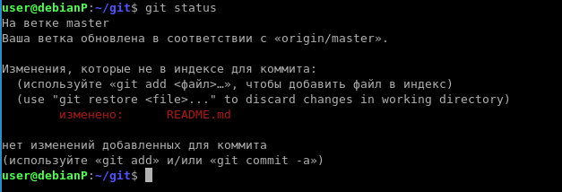

# git
# Домашнее задание к занятию "8-1_GIT" - `Рыбакин Алексей`
### Задание 1

[задание 1](https://github.com/pam3ec84/git/commit/ee01221ca0514e69a171bf4b2c3fd010819030d9)
### Задание 2
[Задание 2](https://github.com/pam3ec84/git/commit/62e2e47f86519e93ba4348d3d65e7136bc18f7d2)
